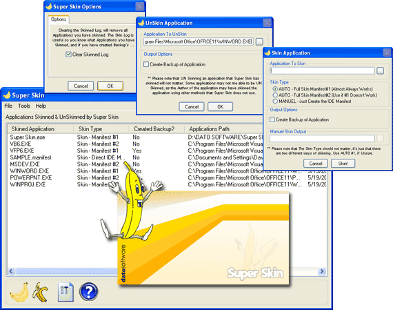



## Super Skin

### Description

Ever wanted to Skin your Own Application, to run &#8216;Native&#8217; (Visual Styles) on Windows XP or Vista? Maybe you run Window Blinds, and have a Really COOL theme, so kool, that when you run an Application that doesn&#8217;t run Native, your disgusted by that ugly plain Dialog Box!

All your problems are now Solved with &#8220;Super Skin&#8221;, the state of the Art Application Skinning Software, for Home Users, and Software Programmers. This Program supports Complete application Skinning, for ANY program. (I have only tried it in VB, C++, C, FOX, DELPHI, and Native Windows [Which is just about everything!])

Please download this software, form PS Code, or if you don&#8217;t have VB, or you want all the Drivers Download It From: www.datosoftware.com/downloads/

Please leave your Votes, Comments, and anything else you wish to leave.

P.S. I am thinking of creating a second version already, so if you want to help in this Project please Contact me, all the Info is in the &#8216;readme.wri&#8217; file.
 
### More Info
 

             |
---                |---
**Submitted On**   |2005-05-19 12:08:10
**By**             |[Dave Nedved](https://github.com/Planet-Source-Code/PSCIndex/blob/master/ByAuthor/dave-nedved.md)
**Level**          |Intermediate
**User Rating**    |4.9 (39 globes from 8 users)
**Compatibility**  |VB 5\.0, VB 6\.0
**Category**       |[Complete Applications](https://github.com/Planet-Source-Code/PSCIndex/blob/master/ByCategory/complete-applications__1-27.md)
**World**          |[Visual Basic](https://github.com/Planet-Source-Code/PSCIndex/blob/master/ByWorld/visual-basic.md)
**Archive File**   |[Super\_Skin1889575182005\.zip](https://github.com/Planet-Source-Code/dave-nedved-super-skin__1-60585/archive/master.zip)

